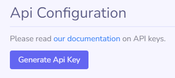
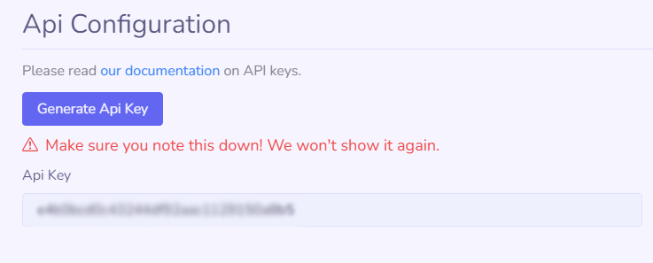
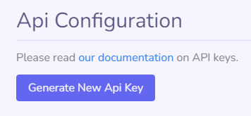
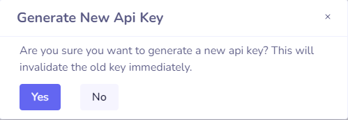

### Generating API Key

    <i class="material-icons" style="font-size: 24px;">warning</i>
    

        Handle your API key securely. It grants full access to your organization’s PublicBacklog endpoints. Store it in environment variables and manage it through your deployment process. Never expose it in client-side code.
   
 

API key generation is simple. The key is shown only once; it won't be visible after you leave the page. Record it immediately.

### Regenerating your API key

To change your API key, go to API Configuration in Organization Settings and click Generate New API Key. The process is the same as initial creation.

**This action immediately invalidates the previous API key.**

#### Examples

For examples on how to include your API key in requests head to the [Endpoints Documentation](/api/?id=public-backlog-api-documentation)