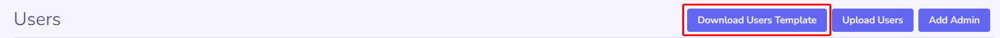
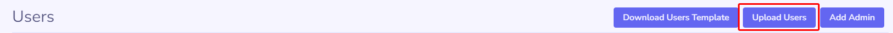
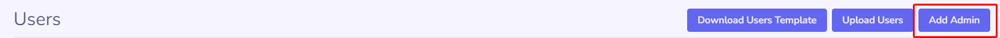
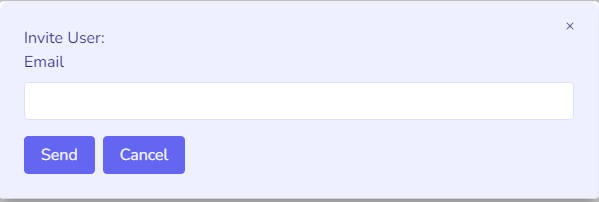
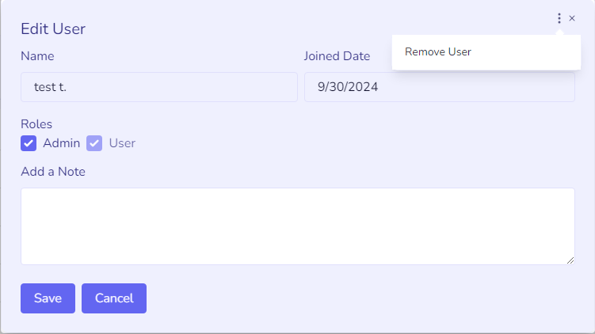

### Overview

Organization Users are the people giving feedback to improve your product or service.

There are two roles: **Users** and **Admins**.

**Users** can access all content under the `_feedback` section.

**Admins** have full access to the admin interface, including ticket approval, roadmap updates, announcements, and more.

### Adding Organization Users

#### Public Backlogs

By default, users can join a public Backlog without admin approval.

#### Private Backlogs

    <i class="material-icons" style="font-size: 24px;">warning</i>
    

        Backlogs are <strong style="color: #92400e">public</strong> by default. You can change this in Organization Settings.
   
 

If your Backlog is private, you have two options for allowing users to submit feedback, depending on your PublicBacklog integration method.

#### With the &nbsp; [Simple Setup]()

The Simple Setup offers limited control over who can give feedback.

In the [Organization User Management]() section of your Backlog, you'll find two buttons: **Upload** and **Download**.

Start by clicking **Download**.

You can also download the template directly from [here](https://api.publicbacklog.com/files/user-template).

Populate the file with users you want to grant feedback access to across all Backlogs in the Organization.

Only the **email** field is required. It serves as the unique identifier. If **first** and **last names** are omitted, the system uses the Backlog name as the first name and “User” as the last name. You can also supply only a first name; in that case, the last name will be left blank.

After filling out the template, upload it using the **Upload Users** button.

Once uploaded, users will receive an email asking them to confirm if they want to receive communications. Regardless of their response, they will immediately gain access to all Backlogs in the Organization and can leave feedback.

These users have basic access to the feedback sections only. They cannot access the admin interface.

#### With the &nbsp; [Advanced Setup]()

The Advanced Setup provides the most flexibility for managing users who can give feedback. It requires deeper code integration and testing on your end. If you're using private Backlogs, this is the recommended approach.

An API endpoint is available to add an Organization user. This endpoint only supports adding regular users—not admins. Users added through this method can immediately interact with private Backlogs after redirect.

View the endpoint documentation [here](/api/?id=add-organization-user).

#### Adding an adiminstrator

Many organizations require multiple people to manage operations. While each Organization can have only one owner, it can have a limited number of administrators based on the Organization subscription tier.

To add an administrator, go to the **User** section in **Organization Settings**. In the top-right button group, click **Add Administrator**.

Enter the admin's email address to send them an invitation link.

Admin users must confirm their email before they can sign in or perform any actions within the Organization or its Backlogs.

### Removing Users

To remove a user from a Backlog, go to the **User Management** section, select the user, click the **ellipsis** button at the top, and choose **Remove User**.

This performs a soft delete, preventing the user from rejoining the Organization.

### Readding Deleted Users

To re-add a deleted user:
- For an **Admin**, use the **Add Admin** button. No email confirmation is required.
- For a **regular user**, use the **Upload Users** functionality. Email confirmation is not required.

