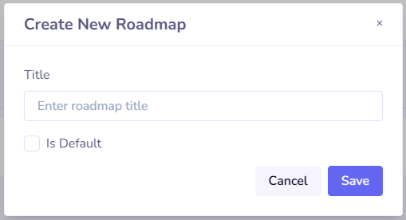

### What is a Roadmap?
A Roadmap provides a quick view of the overall status of Tickets in a Backlog.

Roadmaps are tied to their associated Backlog.

The [statuses]() used in Roadmaps are **Approved**, **In Development**, and **Done**.

#### Creating a Roadmap

Creating a Roadmap takes just a few clicks.

Go to the `_roadmaps` page from the left sidebar of your Backlog. Click **Create Roadmap** in the top-right corner.

This opens the creation modal. The only required field is **Name**.

When saved, a check runs to see if a roadmap already exists:
- If none exists, the new roadmap is automatically set as default.
- If one exists, the new roadmap is only set as default if **Is Default** is checked. If so, the current default will be unset.

#### Add a Ticket to a Roadmap
Adding a Ticket to a Roadmap is automatic. When a ticket moves from **New** to **Approved**, it’s added to the Backlog’s default roadmap if one exists.

For older tickets, go to the **Roadmap** tab in the [Admin Ticket View]() to manually add them.

Tickets can be part of multiple roadmaps but are only shown in the default roadmap in the [User view]().

#### Remove a Ticker from a Roadmap

There are two ways to remove a ticket from a Roadmap:

1. From the [Admin view]() of the ticket under the **Roadmaps** tab:

Click the x next to the roadmap to remove the ticket.

1. From the `_roadmaps` page of your [Backlog]():

Select a roadmap to view its tickets:

Click the x next to the ticket to remove it. This does not affect the ticket in any other way.
