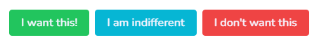
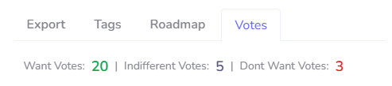

### **What is a ticket?**

A ticket is the core unit of feedback in PublicBacklog. Both you and your users create and use tickets to track input.

All tickets receive a sequential numeric ID starting at **1**. These IDs are unique to the Organization, **not** to individual Backlogs.

Tickets have two viewing modes: **User** view and **Admin** view.

#### **User View**

The user view is what most users will see. It’s primarily read-only, with input limited to the want/indifferent/do not want voting section and the ability to add or reply to comments.

#### **Admin View**

The admin view provides full control over a ticket—title, description, tags, files, status, and more.

This is the default view when accessing tickets from the main dashboard. From the `_feedback` section, the default is the user view, with a cog icon to switch to admin view.

Below are the individual components of the admin view

#### **Export**

Tickets connect with external systems through their [integrations](/).

These allow tickets to be exported to your internal developer backlogs. PublicBacklog currently supports direct exports to:

*   GitHub
*   Jira
*   Asana

_More to come..._

Additional integrations for features like notifications are available here.

#### Tags

Tags help categorize and organize tickets. They are free-form and can contain any text including symbols.

Tags are searchable via filters on the `_tickets` page.

By default, tags are hidden in the **user** view. This can be changed in Organization settings if you want to use tags to reflect a status outside the standard ticket status field.

#### Roadmaps

Roadmaps give users a quick view of ticket status within your Backlogs.

PublicBacklog uses three roadmap categories: **Approved**, **In Progress**, and **Done**.

On the `_feedback` page, the **default** roadmap is shown before a user selects a specific ticket.

When a ticket is saved, if its status is Approved, In Progress, or Done—and it’s not already in the default roadmap—it will be added automatically.

You can also manually add tickets to roadmaps. If a ticket is in **New** status, it will be set to **Approved** when added.

Find out more about Roadmaps [here](/roadmaps/).

#### Votes

Votes let users quickly express their opinion on a ticket using one of three options:

In the admin view, vote stats are visible, giving a high-level summary of sentiment toward the ticket.

